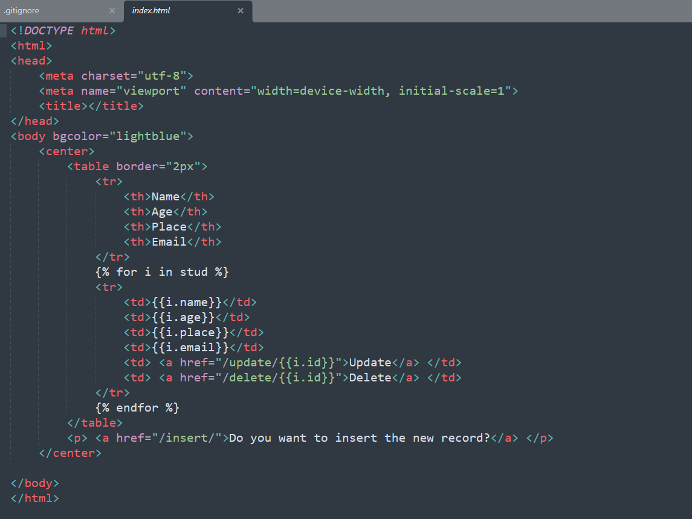
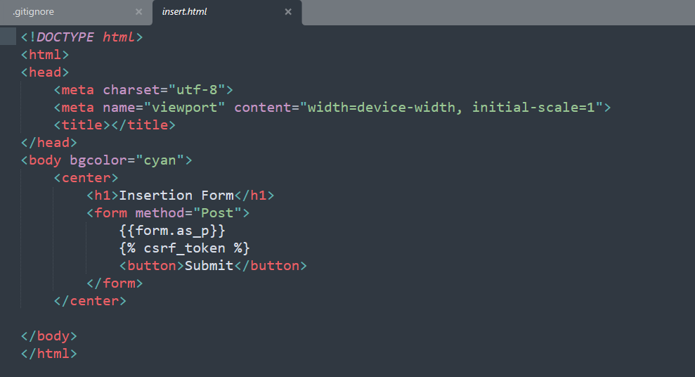
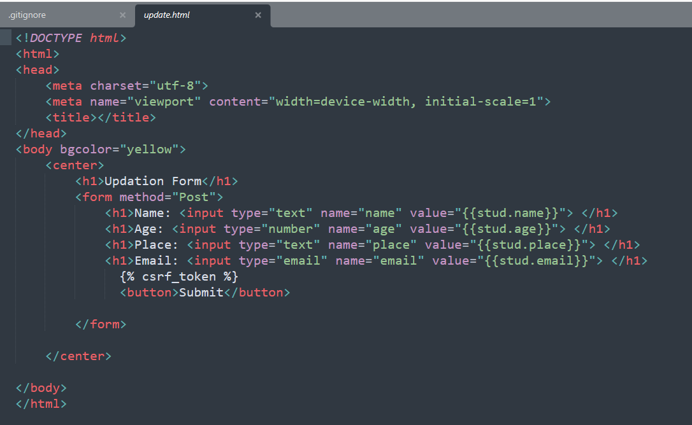

# Django CRUD Project

## 📌 Description
This is a CRUD (Create, Read, Update, Delete) web application built using Django.

## 🚀 Features
- Add new data
- View data
- Update data
- Delete data
- User authentication (Login/Logout)

## 🛠️ Technologies Used
- Python
- Django
- HTML, CSS, JavaScript
- SQLite / Oracle

## ▶️ How to Run
1. Clone the repository
2. Run `python manage.py runserver`
3. Open http://127.0.0.1:8000/

## 📷 Screenshots

### 🔐 Index Page

### 📊 Insert Page

### ⚙️ Update Page

## 👨‍💻 Author
Teju Patel G D
